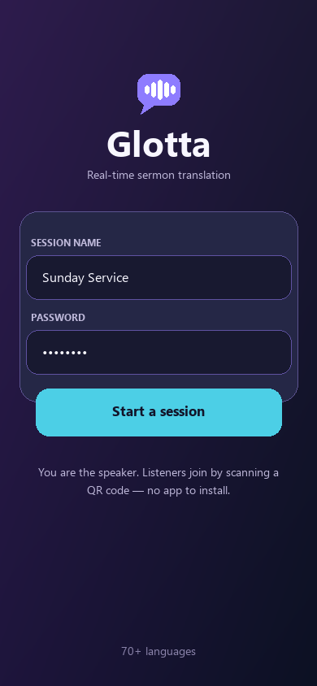
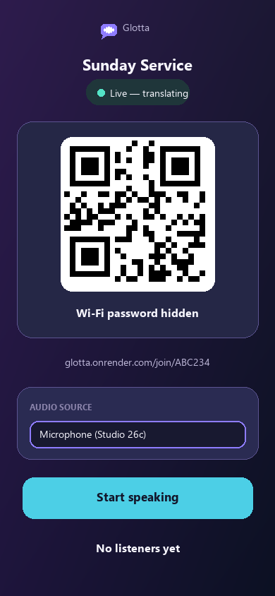
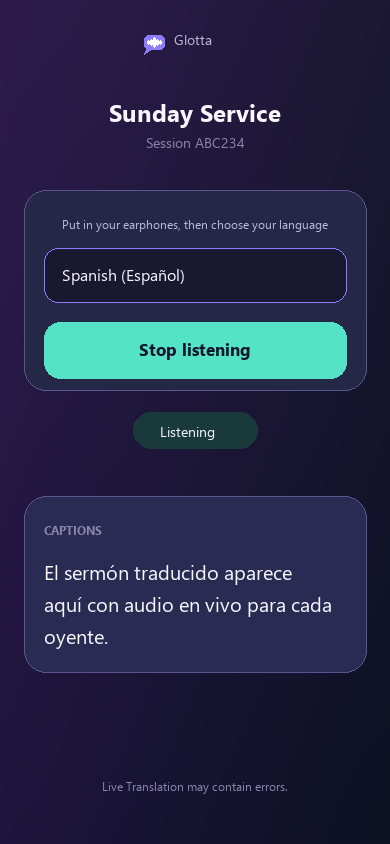

# Glotta

Glotta is a real-time sermon translation app powered by Google's `gemini-3.5-live-translate-preview` model. A speaker starts one live session, shares a QR code, and listeners join from their phone browser to hear translated audio with captions in 70+ languages.

<p align="center">
  
  
  
</p>

## What it does

- Creates a speaker-led translation session with a QR join link.
- Streams microphone or sound-board audio to a Node.js relay server over WebSockets.
- Uses Gemini Live Translate to generate translated speech and captions.
- Supports multiple listener languages at the same time, with one shared Gemini stream per language.
- Lets listeners join from a browser without installing an app.
- Shows the speaker live listener counts, an audio input meter, and a bounded source transcript.

## How it works

```text
Speaker browser/app -> PCM audio over WebSocket -> Node relay server -> Gemini Live Translate
                                                        |
                                                        v
Listener browser <- translated audio + captions over WebSocket
```

The server keeps the Gemini API key private, manages live sessions, fans speaker audio out to each active language stream, and broadcasts translated audio/captions back to listeners. Browser listeners use a continuous Web Audio playback queue that stays close to live and drops stale audio rather than drifting far behind.

## Repository layout

| Folder | Purpose |
| --- | --- |
| `server/` | Express/WebSocket relay server and browser UI for speaker/listener pages. |
| `app/` | Expo React Native speaker app. |
| `docs/screenshots/` | README screenshots. |

## Prerequisites

- Node.js 20.19.4 or newer.
- A Gemini API key with access to Gemini Live Translate.
- A public HTTPS deployment for real services, or a shared local network for testing.

## Run the relay server locally

Run these commands in **PowerShell**:

```powershell
cd "C:\Users\nafer\github repo\Glotta\server"
npm install
```

Create a `.env` file in `server/`:

```env
GEMINI_API_KEY=your-gemini-key
PASSWORD=choose-a-speaker-password
```

Start the server:

```powershell
npm start
```

Then open `http://localhost:8080`, start a session, and share the QR/join link with listeners on the same network.

## Run the mobile speaker app

Run these commands in **PowerShell**:

```powershell
cd "C:\Users\nafer\github repo\Glotta\app"
npm install
```

Set the relay URL in `app/src/config.js` or type it in the app setup screen:

```js
export const DEFAULT_SERVER_URL = 'https://your-glotta-server.example.com';
```

For iOS device builds from Windows, use EAS Build:

```powershell
npm install -g eas-cli
eas login
eas build --platform ios --profile preview
```

## Deployment notes

Deploy `server/` to a Node host such as Render, Railway, Fly.io, or a VPS. Configure:

```env
GEMINI_API_KEY=your-gemini-key
PASSWORD=choose-a-speaker-password
PUBLIC_BASE_URL=https://your-public-url.example.com
```

The relay server stores live sessions in memory, so free-tier hosts that sleep or restart can interrupt active sessions. The speaker page includes session revival logic to recreate the same QR code when possible, but a production deployment should use a host that stays awake during services.

## Reliability details

- Speaker audio is sent as small PCM chunks over WebSockets.
- Browser speaker input can select external audio interfaces and chooses the strongest channel for sound-board feeds.
- Listener playback uses one continuous PCM queue with a small buffer, smooth underrun recovery, and stale-audio dropping.
- Listeners returning after a longer phone-app switch are asked to tap once to restart browser audio while captions remain connected.
- Live transcript and captions are capped in the browser to prevent long sermons from overloading the page.
- Gemini streams use session resumption and context compression across periodic connection replacements, with a short catch-up window for brief gaps.
- A session automatically ends after 60 minutes without incoming speaker audio.

## License

MIT License. See [LICENSE](LICENSE).
