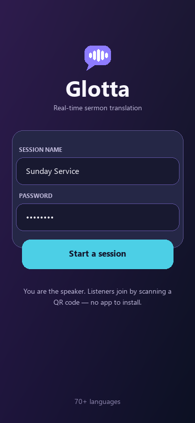
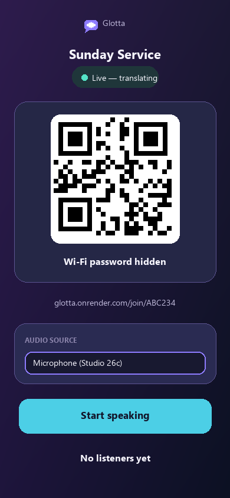
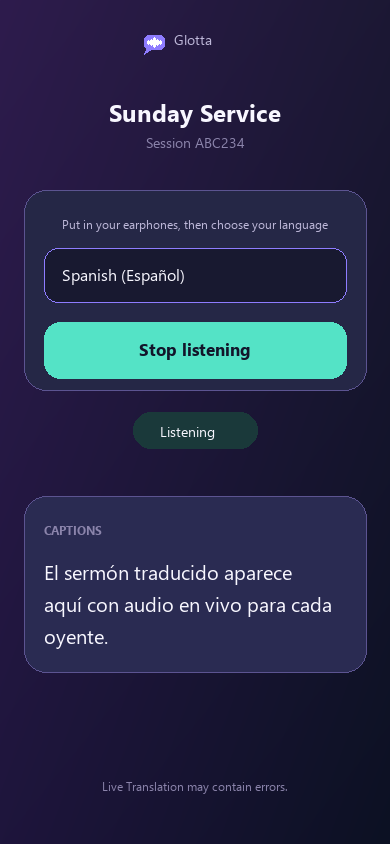

# Glotta

Glotta is a real-time translation platform for lectures, trainings, sermons, and other live spoken events, using speech-to-speech LLMs. A speaker starts one live session, chooses Google Gemini or OpenAI GPT, shares a QR code, and listeners join from their phone browser to hear translated audio with captions.

<p align="center">
  
  
  
</p>

## What it does

- Creates a speaker-led translation session with a QR join link.
- Streams microphone or sound-board audio to a Node.js relay server over WebSockets.
- Uses Gemini Live Translate or OpenAI `gpt-realtime-translate` to generate translated speech and captions.
- Defaults each new session to Production mode and Google Gemini, with a free Testing mode and an OpenAI GPT provider option for comparison and fallback.
- Supports multiple listener languages at the same time, with one shared provider stream per language.
- Lets listeners join from a browser without installing an app.
- Shows the speaker live listener counts, an audio input meter, and a bounded source transcript.
- Optionally emails the weekly sermon's transcript after each Sunday service, trimmed to the sermon and proofread by a Gemini or OpenAI model.

## How it works

```text
Speaker browser/app -> PCM audio over WebSocket -> Node relay server -> Gemini or OpenAI
                                                        |
                                                        v
Listener browser <- translated audio + captions over WebSocket
```

The server keeps all provider API keys private, manages live sessions, fans speaker audio out to each active language stream, and broadcasts translated audio/captions back to listeners. Browser listeners use a continuous Web Audio playback queue that stays close to live and drops stale audio rather than drifting far behind.

## Translation providers

The browser landing page shows a Google Gemini/OpenAI GPT selector below the weekly-session button, followed by a Production/Testing mode selector. Gemini and Production are selected by default. Production uses paid API access for stable live events. Testing uses the free Gemini key and can be unstable or stop temporarily. Testing can be selected only with Gemini; choosing OpenAI forces Production and disables Testing.

| Provider | Target output languages | Notes |
| --- | --- | --- |
| Google Gemini | 70+ | Listener audio/captions use `gemini-3.5-live-translate-preview` only for active listener languages. Production speaker captions use `gemini-3.5-transcribe-live`; Testing keeps the free Live Translate stream. |
| OpenAI GPT | 13 | Uses `gpt-realtime-translate`, which automatically detects 70+ spoken input languages. Production only. |

The browser sends the selected provider and session mode to Glotta. The API keys remain on the relay server. The speaker page remembers both selections so recovery after a Render restart preserves them. Glotta streams audio and captions in memory and does not persist them to a database or file. If the sermon transcript email is configured, the weekly session's speaker transcript is also held in memory during the service windows until it is emailed, then erased. The provider and session mode are fixed for the life of an active session; reconnecting the weekly code with different selections shows an error instead of silently switching keys.

## Repository layout

| Folder | Purpose |
| --- | --- |
| `server/` | Express/WebSocket relay server and browser UI for speaker/listener pages. |
| `app/` | Expo React Native speaker app. |
| `docs/screenshots/` | README screenshots. |

## Prerequisites

- Node.js 20.19.4 or newer.
- Free and paid Gemini API keys with access to Gemini Live Translate, plus paid access to Gemini Live Transcribe.
- An OpenAI API key with access to `gpt-realtime-translate` for the optional OpenAI provider.
- A public HTTPS deployment for real services, or a shared local network for testing.

## Run the relay server locally

Run these commands in **PowerShell**:

```powershell
cd "C:\Users\nafer\github repo\Glotta\server"
npm install
```

Create a `.env` file in `server/`:

```env
GEMINI_API_KEY_FREE=your-free-gemini-key
GEMINI_API_KEY_PAID=your-paid-gemini-key
OPENAI_API_KEY=your-openai-key
PASSWORD=choose-a-speaker-password
LIVE_EDGE_MAX_QUEUE_SECONDS=0
```

Start the server:

```powershell
npm start
```

Then open `http://localhost:8080`, start a session, and share the QR/join link with listeners on the same network.

## Run the mobile speaker app

Run these commands in **PowerShell**:

```powershell
cd "C:\Users\nafer\github repo\Glotta\app"
npm install
```

Set the relay URL in `app/src/config.js` or type it in the app setup screen:

```js
export const DEFAULT_SERVER_URL = 'https://your-glotta-server.example.com';
```

For iOS device builds from Windows, use EAS Build:

```powershell
npm install -g eas-cli
eas login
eas build --platform ios --profile preview
```

## Deployment notes

Deploy `server/` to a Node host such as Render, Railway, Fly.io, or a VPS. Configure:

```env
GEMINI_API_KEY_FREE=your-free-gemini-key
GEMINI_API_KEY_PAID=your-paid-gemini-key
OPENAI_API_KEY=your-openai-key
PASSWORD=choose-a-speaker-password
PUBLIC_BASE_URL=https://your-public-url.example.com
```

The relay server stores live sessions in memory, so free-tier hosts that sleep or restart can interrupt active sessions. The speaker page includes session revival logic to recreate the same QR code when possible, but a production deployment should use a host that stays awake during services.

## Sermon transcript email

When configured, Glotta collects the weekly session's speaker transcript during the Sunday service windows and emails the sermon once per window, 10 minutes after the window ends, whether the session has ended, is still live, or was restarted in between.

- Only the weekly session code (`WEEKLY_SESSION_ID`, default `SERMON`) is collected, and only inside `SERMON_WINDOWS`. Collecting stops at the end of a window; a live session keeps running untouched.
- `SERMON_EMAIL_MODEL` first returns only the numbers of the sermon's first and last sentences, and the server cuts the original transcript there. If the model is unsure or fails, the full window transcript is used instead.
- The same model then proofreads the sermon a few paragraphs at a time, following `SERMON_PROOFREAD_PROMPT`: it removes filler words such as "uh" and "um" and accidental repeats, and corrects misheard words, punctuation and spelling from context. The server always adds fixed rules (keep the preacher's words, grammar and order; add or remove nothing) and keeps each corrected paragraph only if it stays faithful: about a third of its words changed at most, misheard words replaced at most five in a row, and at most two words in a row dropped or added without a replacement. Otherwise the original paragraph is sent. `SERMON_PROOFREAD=off` turns proofreading off.
- A trim or proofreading call that fails (an error, a timeout, or an unusable reply) is retried after 15 seconds; the third and last attempt uses `SERMON_EMAIL_FALLBACK_MODEL` (default `gpt-6-luna`). If all three fail, the email is still sent, with that part untrimmed or uncorrected.
- The email contains only a title such as "Sunday Morning Sermon – October 11, 2026" and the sermon. Technical details (trim and proofreading results, a server start during a window, a size-limit cut) go to the `[sermon-transcript] sent` log line instead.
- The transcript lives only in memory and is erased after the email is sent. A failed send is retried every 5 minutes for 30 minutes, then the transcript is erased. A server restart also erases it.
- While a transcript is waiting, the server requests its own `/healthz` page every 5 minutes so Render's free plan does not put it to sleep before the email is sent.

| Setting | Example | Purpose |
| --- | --- | --- |
| `BREVO_API_KEY` | `xkeysib-...` | Brevo API key used to send the email. |
| `SERMON_EMAIL_TO` | `you@example.com` | Recipient; separate several with commas. |
| `SERMON_EMAIL_COPY_TO` | `you@example.com` | Optional hidden copy (BCC) of every email; an address already in `SERMON_EMAIL_TO` is skipped. |
| `SERMON_EMAIL_FROM` | `you@example.com` | Sender; must be verified in Brevo. |
| `SERMON_EMAIL_FROM_NAME` | `Glotta` | Sender name (default `Glotta`). |
| `SERMON_TIMEZONE` | `America/Chicago` | Time zone of the windows (default `America/Chicago`). |
| `SERMON_WINDOWS` | `Sun 11:00-12:20, Sun 18:10-19:20` | Service windows, 24-hour local time. |
| `SERMON_EMAIL_MODEL` | `gemini-3.5-flash` | Gemini (`gemini-...`) or OpenAI (`gpt-...`, `o4-mini`) model used, in separate calls, to trim and to proofread; uses the existing paid Gemini or OpenAI key. |
| `SERMON_EMAIL_FALLBACK_MODEL` | `gpt-6-luna` | Model for the third attempt of a call that failed twice (default `gpt-6-luna`). |
| `SERMON_TRIM_PROMPT` | | What counts as the sermon; a built-in default is used if unset. The reply format is added by the server. |
| `SERMON_PROOFREAD_PROMPT` | | How to correct the sermon; a built-in default is used if unset. The faithfulness rules and reply format are added by the server. |
| `SERMON_PROOFREAD` | `off` | Optional; proofreading is on unless this is `off`. |

The email feature is off unless `BREVO_API_KEY`, `SERMON_EMAIL_TO`, `SERMON_EMAIL_FROM`, and `SERMON_WINDOWS` are set.

## Reliability details

- Speaker audio is sent as small PCM chunks over WebSockets.
- Only one device can capture speaker audio for a session at a time; the lock starts with **Start speaking** and is released by **Stop speaking** or a disconnect.
- Browser speaker input can select external audio interfaces and chooses the strongest channel for sound-board feeds.
- Listener playback uses one continuous PCM queue with a small buffer, smooth underrun recovery, and stale-audio dropping.
- Listeners returning after a longer phone-app switch are asked to tap once to restart browser audio while captions remain connected.
- Live transcript and captions are capped in the browser to prevent long sermons from overloading the page.
- When Gemini announces a listener connection's replacement (`GoAway`), Glotta opens a fresh standby connection, sends it the same speaker audio, and moves listeners to it at a pause before the old connection closes. Gemini streams use session resumption and context compression for unplanned reconnects; both providers use a short live-edge catch-up window for brief gaps.
- The speaker transcript gets its own handover: at a pause in the speaker's audio, the old connection keeps everything before the pause and the fresh one everything after it, so no words are lost or transcribed twice. The old connection then hears silence for up to three seconds to finish its last phrase.
- Each listener language restarts independently after 20 seconds of voiced source audio without translated captions; audio packets alone do not count as healthy output because they may contain silence.
- Audio queue, reconnect, first-output, and dropped-audio metrics are emitted as structured `[audio-metrics]` logs. Healthy stream counters are aggregated into one-minute summaries, while stalls and queue drops remain immediate or rate-limited to ten seconds.
- `LIVE_EDGE_MAX_QUEUE_SECONDS` is an opt-in safety flag. Leave it at `0` for legacy behavior; set it to `1` for a one-second network-queue budget and a two-second listener buffer. Enabled values are capped at one second so Glotta's own buffering cannot exceed five seconds even if the setting is accidentally higher.
- A session keeps capturing through an hour of silence; silent audio packets count as incoming audio. It automatically ends after 60 minutes without any incoming speaker audio packets (or longer if configured with `SESSION_AUDIO_IDLE_MINUTES`).
- Sessions have a four-hour total limit, including time spent waiting before speech begins.
- Both the no-audio timeout and the four-hour limit stop the speaker page with an explanation and require starting a new session; neither automatically revives the ended session.

## License

MIT License. See [LICENSE](LICENSE).
